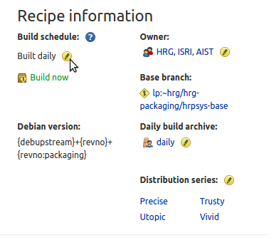
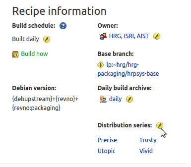
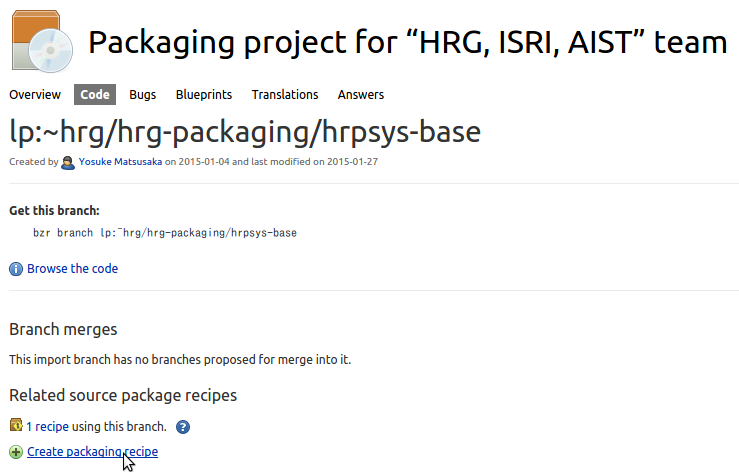

=====================================
 HRG packagingの利用方法(開発者向け)
=====================================

はじめに
========

HRG packagingはlaunchpadのPPAサービスを使って、hrpsys-base, choreonoid, OpenHRPなどのロボット関連ソフトウェアの最新版を容易にインストールできるようにしたパッケージです。

このドキュメントではlaunchpadのPPAサービスの利用方法を説明します。

launchpad Daily Build機能の仕組み
=================================

launchpadにはソースコードの最新版を毎日ビルドして自動でパッケージ化してくれるDaily Buildという機能があります。

Daily Buildではビルド元のソースコードはすべてlaunchpadのコードレポジトリに登録しなければなりません。ただし、外部のコードレポジトリでホストされたソースコードでもビルドできるように、ソースコードをlaunchpadのコードレポジトリに定期的にミラーする機能があります。

HRG packagingでは、hrpsys-base, choreonoid, OpenHRPの各ソースコードについてはgithubからミラーするように設定し、パッケージをビルドするために必要なdebianフォルダ以下の各設定ファイルについてはlaunchpadで直接ホストしています。

ソースコードと設定ファイルはrecipeの設定によって一つのソースツリーの形に再構成されビルドが行われます。

.. graphviz::

   digraph foo {
      "source(github,git)" -> "mirror(launchpad,bzr)"
      "mirror(launchpad,bzr)" -> "recipe"
      "debian(launchpad,bzr)" -> "recipe"
      "recipe" -> "build"
   }

HRG packagingのソースコードとrecipe
===================================

ソースコードについては以下のURLから閲覧できます。*-debとなっているソースコードについては各ソフトウェアのパッケージのビルドに必要なdebianフォルダの内容です。それ以外のソースコードは外部レポジトリのミラーです。

https://code.launchpad.net/hrg-packaging

Daily Buildを行うための設定(recipeと呼ばれる)は以下のURLから閲覧できます。パッケージ作成の元となるソースコード(ベースブランチ)にdebianフォルダ部分をオーバーレイしてビルドする設定が格納されています。

https://code.launchpad.net/~hrg/+recipes

recipeのページからビルド状況の確認やビルドの手動トリガを出すこともできます(後で詳述します)。

パッケージの更新に必要なbzrコマンド集
=====================================

ソフトウェア本体の修正については元の外部レポジトリのソースコードを修正することで、その変更が自動でミラーされ定期ビルドが行われますが、パッケージ部分の更新にはbzrコマンドを使う必要があります。

bzrはgitに似た分散バージョン管理システムです。

以下、パッケージの更新に必要な各コマンドの使い方を説明します。

launchpadコードレポジトリの利用に必要な初期設定
-----------------------------------------------

launchpadコードレポジトリの利用にはlaunchpadアカウントが必要です。launchpadのホームページからアカウントを作成してください。

また、bzrを使うにはlaunchpadにsshの公開鍵を登録し、bzr launchpad-loginコマンドを使ってログインIDを設定する必要があります。
初期設定の詳細な手順については以下のページを参照してください。

http://doc.bazaar.canonical.com/latest/en/mini-tutorial/

ビルドに必要な依存ライブラリの追加
----------------------------------

ソフトウェアが依存するライブラリが増えた場合などは、debian/controlファイルを編集して依存ライブラリを追加する必要があるでしょう。

そのような場合には、まず、ソースコードのdeb部分をチェックアウトします::

  $ bzr branch lp:~hrg/hrg-packaging/hrpsys-base-deb

debian/controlファイルを編集します::

  $ cd hrpsys-base-deb
  $ vi debian/control

bzrコマンドを使って変更をコミットしプッシュします::

  $ bzr add debian/control
  $ bzr commit -m "add dependent library"
  $ bzr push lp:~hrg/hrg-packaging/hrpsys-base-deb

コミットされた変更は後で自動でビルドされますが、後述するビルドの手動トリガ機能を使ってすぐにビルドさせて結果を確認することもできます。

バージョン番号の更新
--------------------

Daily Buildパッケージは以下の規則によってバージョン番号が付与されます::

  [パッケージ名]-[upstreamバージョン番号]-[レポジトリ連番]-[debianレポジトリ連番]

パッケージは外部レポジトリの更新があると自動でビルドされ連番が付与されますが、リリースによってバージョン番号が更新された場合は、debian/changelogファイルを編集してパッケージのupstreamバージョン番号を更新する必要があります。

そのような場合には、まず、ソースコードのdeb部分をチェックアウトします::

  $ bzr branch lp:~hrg/hrg-packaging/hrpsys-base-deb

dchコマンドを使ってdebian/changelogファイルを編集します::

  $ cd hrpsys-base-deb
  $ dch

bzrコマンドを使って変更をコミットしプッシュします::

  $ bzr add debian/changelog
  $ bzr commit -m "bump version number"
  $ bzr push lp:~hrg/hrg-packaging/hrpsys-base-deb

コミットされた変更は後で自動でビルドされますが、後述するビルドの手動トリガ機能を使ってすぐにビルドさせて結果を確認することもできます。

ビルドの手動トリガ
==================

recipeを使ったビルドには手動でトリガを発生させることができます。

手動でトリガを発生させるためにはページ下部の"Request build(s)"ボタンをクリックします。

すると以下のダイアログが開くので、出力したいPPAのURLを指定して"Request Builds"ボタンをクリックします。

出力したいPPAのURLにdailyのURLを指定するとパッケージのビルドを即座にテストできます。ここで、stableのURLを指定すると、ソフトウェアのバージョンアップなどのタイミングで行う安定版の選択的な出力をすることができます。

.. image:: manual-build.png

ビルド通知、自動ビルドの制御
============================

ビルドが失敗した場合はメールでビルド通知が行われ、成功した場合は通知が行われません。launchpadではこの設定は固定でありユーザが変更することはできません。

特にパッケージ化のテスト中などの局面でメールが多く送信されるため、それらのメールが不要な場合はユーザの個人アカウントのページで、メールアドレスを予備のものに変更することでメールの新着通知に惑わされるのを避けることができます。

ビルド元のソースコードに大きな改変が加えられ、大量のビルドエラーメールが送信されるようになってしまった場合、自動ビルドを一時的に無効にすることでメールを止めることもできます。自動ビルドを無効にするにはrecipeのページでBuild scheduleの部分にある設定変更ボタンを押してBuilt dailyからBuilt on requestに設定を変更してください。

ビルドを行うオペレーティングシステムの種類を追加・削除する方法
==============================================================

ビルドを行うオペレーティングシステムの種類を追加・削除するにはrecipeのページのDistribution seriesの部分にある設定変更ボタンを押して、希望の種類を選択してください。

ビルドする対象ソフトウェアを追加・削除する方法
==============================================

ビルドする対象ソフトウェアを追加するためには以下のプロジェクトページからConfigure code hostingをクリックします。

https://code.launchpad.net/hrg-packaging

コードをlaunchpad自身でホストする場合はLink to a Bazaar branchを選択(Branch名は空白)します。

外部レポジトリからインポートする場合はImport a branch hosted somewhere elseを選択しレポジトリのURLを入力し、レポジトリで使われているバージョン管理システムの種類を選択します。

Branch nameにはlaunchpad上のレポジトリの名前を設定します。

レポジトリが作成できたら次にrecipeを作成します。レポジトリのページを開き、Create packaging recipeボタンを押してください。

Nameにはrecipeの名前を入力します。

Use an existing PPAからビルド結果の出力先PPAを選択します。

Default distribution seriesからビルドを行うオペレーティングシステムの種類を選択します。

Recipe textにはバージョン文字列のフォーマット、ベースブランチのURL、オーバーレイするブランチのURLを設定します。例えばhrpsys-baseの場合は以下の設定を行います。

.. code-block:: none

   # bzr-builder format 0.3 deb-version {debupstream}+{revno}+{revno:packaging}
   lp:~hrg/hrg-packaging/hrpsys-base
   nest-part packaging lp:~hrg/hrg-packaging/hrpsys-base-deb debian debian

ソフトウェアに応じてURLを置き換えることでhrpsys-baseと同様の自動ビルドを行うことができます。

この例で使われているnest-partは特定のフォルダを完全に置き換える設定ですが、これ以外にも元のソースにパッチを当てることができるmergeなどを使うことができます。recipeの書き方の詳細については以下のページを参照してください。

https://help.launchpad.net/Packaging/SourceBuilds/Recipes

上記の設定をすべて行うことで自動ビルドが開始されます。

対象ソフトウェアを削除するには、まずrecipeの自動ビルドを無効化するかrecipe自体を削除することで新しいビルドの発生を停止します。

パッケージの古いバージョンも含めて削除(公開停止)したい場合はPPAのページでView package detailsボタンをクリックします。次にDelete packagesボタンをクリックして削除したいパッケージを選択してください。

レポジトリが不要な場合は、レポジトリについても合わせて削除してください。

ビルドの前処理・後処理を変更する方法
====================================

ビルドに前処理・後処理が必要な場合は、debian/rulesファイルを編集して設定を追加します。

debian/rulesファイルはMakefile形式でclean, build, build-arch, build-indep, binary, binary-arch, binary-indepの各ターゲットに対して必要な処理を記述することができます。

build-\*ターゲットにはroot権限を必要としない前処理・後処理を記述します。binary-\*ターゲットにはroot権限が必要な処理を書くことができます。各ターゲットの役割の詳細については以下のページを参照してください。

https://www.debian.org/doc/debian-policy/ch-source.html#s-debianrules

